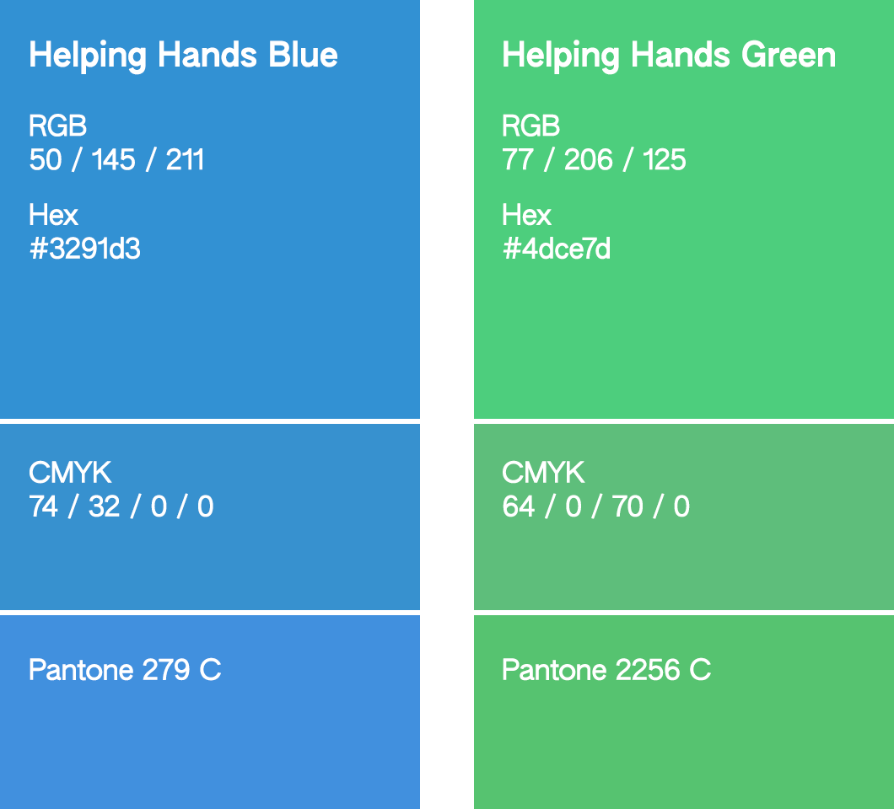

# Helping Hands Identity Toolkit Guidelines

## Logo guidelines

In general, please ensure that your usage of the logo abides by community rules. Do not use the logo in contexts that would not be appropriate for a PG-13 audience. Do not use the logo in conjunction with material that represents graphic violent or sexual content. Do not use the logo in a context intended to defame, belittle, or harass any person or group for any reason.

If you are uncertain if your usage of the logo is appropriate, please contact Helping Hands staff.

Presentation guidelines are provided below.

---

The Helping Hands logo consists of two key components:

- A circle transitioning vertically from Helping Hands Blue (*#3291D3*, Pantone 279C) at the top to Helping Hands Green (*#4DCE7D*, Pantone 2256C) at the bottom, abstractly representing the Earth.
- A pair of white (*#FFFFFF*, Pantone 000C) hands, with the right hands' wrist pointing towards the bottom right of the circle, and the left hands' wrist pointing towards the top left of the circle. The index finger of each hand overlaps the thumb of the opposing hand. The inner wrist path curves to join the curvature at the edge of the circle.

It is OK to substitute these colors with slight variations when necessary for technical requirements (such as due to compression, palette limitations, or different color spaces). However, avoid significant variation if possible. It should be obvious to the viewer what is being represented in the logo.

The color swatches are displayed below.

---

The logo should represent both the hands and the background in the correct orientation and transform. The fingers on the right hand should face upwards. The gradient should start with Helping Hands Blue at the top, transitioning down to Helping Hands Green.

---

The hands of the logo extend to the edge of the underlying circle. Because the hands are displayed in white, it is acceptable to use an outline on either the entire logo or including the interior components if the logo must be displayed on white. However, we recommend using the 'positive space' version of the logo on the right instead for these cases.

---

During special events or in certain circumstances, it can be acceptable to replace the earth behind the hands with a substitute graphic (such as a flag or other event representation). Please be careful to abide by the community rules and all other applicable presentation guidelines when doing this. If you are uncertain if your usage is acceptable, please contact Helping Hands staff.

---

Additional guidelines may be added as deemed appropriate.
